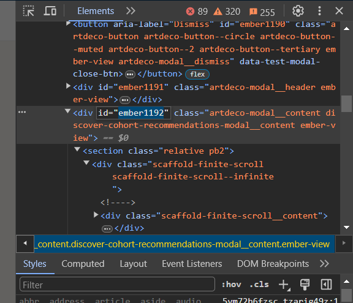

# LinkedIn Connection Automation Script

This script allows you to automate the process of sending connection requests on LinkedIn. With a single click, you can send up to 200 connection requests per week.

## Prerequisites

- A LinkedIn account
- A PC or mobile browser that supports developer tools console

## Instructions

Follow the steps below to use the script:

1. **Open LinkedIn**: Open LinkedIn in your browser and log in to your account.

2. **Access Network Page**: Navigate to your network page and click on 'See All'. This will open a modal with a list of users that LinkedIn suggests you might know.

    

3. **Inspect Scroll Bar**: Right-click on the scroll bar within the modal and select 'Inspect' from the context menu.

    

4. **Copy ID Attribute**: In the inspection pane, double-click on the id attribute and copy the number that appears next to the word 'ember'.

    

5. **Open Console**: Navigate to the console tab within the developer tools.

    

6. **Paste Script**: Paste the following JavaScript code into the console:

    ```javascript
    document.querySelectorAll('.mt2').forEach(element => {
    let button = element.querySelector('button');
    if (!button.getAttribute('aria-label').includes("Pending, click to withdraw invitation sent")) {
        button.click();
        console.log(element.querySelector('button'));
        const divElement = document.getElementById('ember1762');
        divElement.scrollTop = divElement.scrollHeight;
    }
    });
    ```
    Replace '/*replace with the number you copied*/' with the number you copied from the id attribute in step 4.

    

7. **Run Script**: Press Enter to run the script. The script will attempt to send connection requests to a maximum of 200 people.

    

## Note

Please use this script responsibly. LinkedIn may limit or suspend accounts that send too many connection requests in a short period of time.

